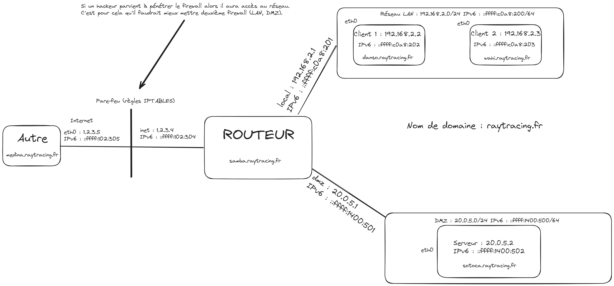

# Guide d'installation

## Explications

Le script `install.sh` permet d'installer le programme java `soumissionJob.jar` sur votre machine. Ce qui fait le lien avec le [RayTracer](https://github.com/PotlaETU/RayTracer).

## 1. Installation 

Il faut cloner le projet sur votre machine avec la commande suivante :

```bash
git clone https://gitlab.univ-artois.fr/louis_karamucki/sae3.01-phasesysrx.git
```

## 2. Lancement du script 

Pour lancer le script d’installation sur votre machine, il suffit de :

Se donner les droit d’éxécution pour le script :

```bash
chmod u+x install.sh
```
Ensuite, en fonction de la machine sur laquelle vous êtes, vous devrez choisir un **paramètre** parmi :

`routeur` | `serveur` | `client1` | `client2` | `autre`

Ces paramètres changent drastiquement le comportement de l'installation, il est donc important de bien choisir le bon paramètre.

Enfin pour lancer le script il suffit juste de lancer cette commande :
```bash
./install.sh <paramètre>
```
## 3. Fin de l'installation

Si vous avez donné le paramètre autre, alors vous devrez manuellement lancer le programme java à l’aide de la commande :

```bash
java -jar /usr/local/soumissionJob.jar
```

Sinon, **au prochain démarrage de votre PC**, le programme java se lancera en arrière-plan sans aucune intervention de votre part.


### **Vous avez maintenant terminé l’installation de votre machine !**

## Annexes

J'ai créé ce schéma en prenant en compte plusieurs paramètres qui me semblait importants dans la conception du réseau de machines comme la **sécurité** ou encore la **fiabilité**.



